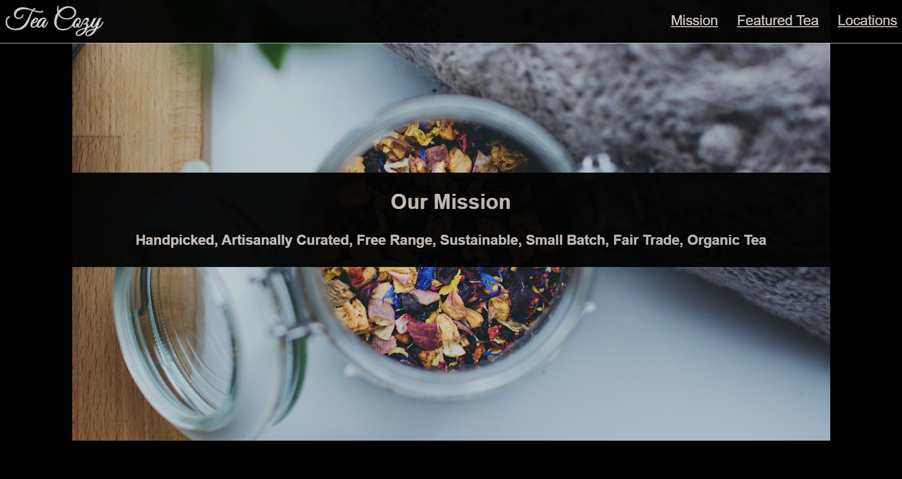

# **Tea Cozy Shop Webpage**
## *Layout based in flexbox CSS3, following a [Design Spec](#design-spec).*
## [Here you can see the demo of this project](https://necogamy.github.io/tea-shop-webpage-flexbox/)

 

## **Design spec**

## **Final Project Overview**

## **Features and Objectives**
* A webpage for a Tea Shop based in FlexBox.
* The objective was to follow a design specification.

## **Built with**
* HTML5
* CSS3 - FlexBox

## **Other tools used**
* Git
* Git Bash Command Line
* GitHub
* IDE: Visual Studio Code
